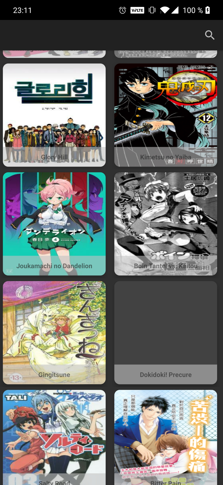
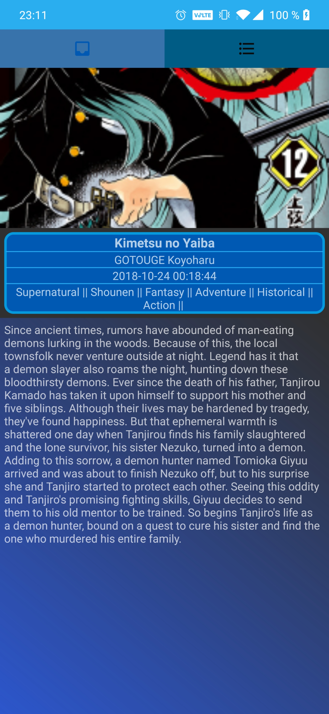
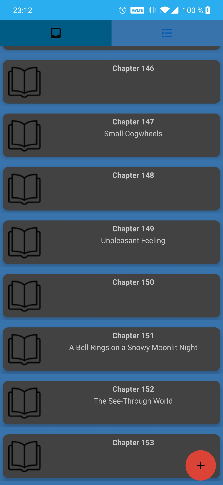
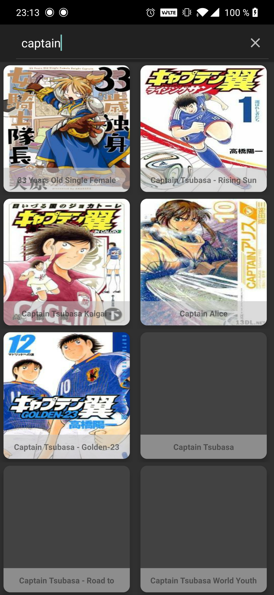

# Lil-Library
Projet par Jean-Baptiste Le Goff 4AFSI2

## Présentation
Application Android en JAVA utilisant l'architerchture MVC. l'application utilise l'api "MangaEden API". Elle permet de chercher et lire (en anglais) les manga disponible sur le site https://www.mangaeden.com 

## Outils de dévelopement

- IDE:Android Studio
- Utilisation de la librairie Retrofit2 pour effectuer les appels au API REST

## Consigne 

- 3 activités et 2 fragments
- Utilisation de RecyclerView
- Appel webservices à une API REST : <a href="https://www.mangaeden.com/api">MangaEden Api</a>
- Architecture MVC
- GitFlow

## Fonctionnalité 
affiche les posters des manga disponible sur https://www.mangaeden.com et permet d'avoir des details (synopsis,auteur,etc..) et de lire les chapitre présents sur le site en cliquant dessus

 

### Splash Screen
Un écran pendant le démarage de l'application

### Home Screen
Le menu d'acceuil de l'application, permet d'accéder à l'ensemble des manga présent sur le site

### Details Screen

 

### Search Screen
  

Note:le site MangaEden.com recensant tout type de manga il peut être possible d'avoir des manga pouvant heurter la sensibilté
de certaine personne
